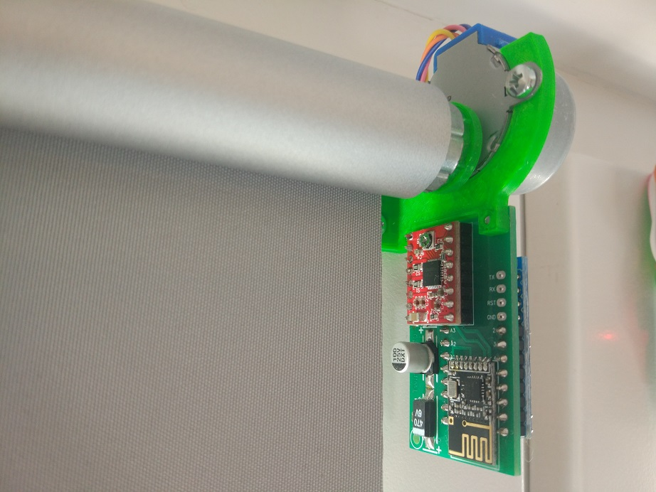

# Automatic roller blinds motor
Automatic window roller blinds that can be controlled wirelessly using a NRF24L01 module. Controlled either by a small remote, web interface or RESTful API.
Built around an Arduino pro mini and a cheap stepper motor.

For the small remote see this project: [automatic roller blinds small remote](https://github.com/asafteirobert/automatic-roller-blinds-remote).

For the web gateway see this project: [automatic roller blinds web interface](https://github.com/asafteirobert/automatic-roller-blinds-web-ui).

## How to use it

This assembly replaces the side of the roller blinds with the string. This means they can no longer be lowered or raised manually.
You will need to route a wire to each window, in order to supply the 9V required.

The blinds are controlled by either the [automatic roller blinds small remote](https://github.com/asafteirobert/automatic-roller-blinds-remote) or the [automatic roller blinds web interface](https://github.com/asafteirobert/automatic-roller-blinds-web-ui), or both.

For more details on how to control and calibrate the blinds, see the related projects linked above. 

## Supported roller blinds

I created this project around a Polish brand(STOL-KAR) of clip-on roller blinds I got from here: https://www.leroymerlin.pl/dekoracja-okien/rolety-i-zaluzje/rolety/roleta-zaciemniajaca-blackout-73-x-150-cm-szara-termoizolacyjna,p575054,l929.html

The shaft has an internal diameter of 18mm.
You will likely need to modify the 3D printed files to adapt for your model. For easier modification, I included the STEP files.

## Limitations and known issues:
- The movement can be slow for some. It takes around 50 seconds to lower and 90 seconds to raise the blinds. Using a bigger stepper motor, such as those used in 3D printers can significantly increase the speed, but would require a much bigger power supply.
- When the blinds are not moving, power is not applied to the stepper motor. This means the blinds can be manually pulled, requiring recalibration.
- There is no encoder, so if the motor gets stuck, misses steps or the blinds are rotated manually, recalibration is needed. Also there are no endstops.

## Making your own
All the required files are included in this project. This includes source code, 3D files to be 3D printed, schematic and PCB.
For instructions see [doc/assembly.md](doc/assembly.md).

## Project status: Finished, active
All intended functionality is implemented and manually tested. I will try to fix major bugs when they are reported. I will review pull requests, but generally I prefer if you fork the project in order to make your own changes and improvements.
