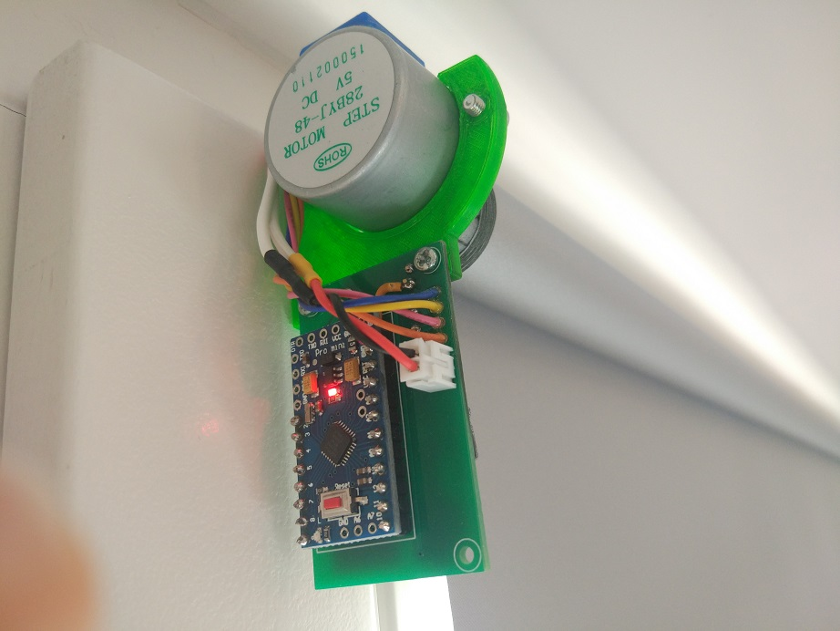

# Automatic roller blinds motor assembly instructions

For this project you will need a 3D printer, patience, fair soldering skills and some experience with Arduino and Platform IO.

## Materials
- Arduino Pro Mini 3v3
- 28BYJ-48 5V stepper motor
- 0805 1uf SMD capacitor
- 100uF(or higher) 25V SMD type D electrolytic capacitor
- 470uf 6V SMD size C tantalum or type D electrolytic capacitor
- NRF24L01+	SMD module
- A4988 or DRV8825 Stepper Motor Driver module
- 9V power supply (recommended 0.5A multiplied by the number of roller blinds)
- Power supply connector (usually DC2.5/5.5) (optional)
- Wire for connecting power
- Pair of XH 2.54mm 2-pin connectors (optional)
- 3D printed parts found in `3d print` folder. 1x motor adapter and 1x mount(or mount-mirrored)
- PCB
- 2x M2x5 screws
- 2x M3x6 screws
- 2x M3 nuts

## The circuit board
You can find the schematic and PCB in the `schematic` folder. It contains an EasyEDA project and Gerber files.

Or simply order the PCB from this link: [https://www.pcbway.com/project/shareproject/](https://www.pcbway.com/project/shareproject/)

## Steps

1. Start by converting the 28BYJ-48 stepper motor from unipolar to bipolar. This is done by carefully removing the blue plastic piece and cutting the central trace.

2. Solder the pin headers for the Arduino Pro Mini and cut the excess pin length. Pin headers only, otherwise you can't do the next step.

3. Solder the A4988 or DRV8825 stepper motor driver module and cut the excess pin length.

4. Solder the Arduino Pro Mini to the pin header and cut the excess pin length.

5. Solder the rest of the components to the PCB. Use double sided tape for the NRF24L01 module to make sure it doesn't touch the nearby pins.

6. Secure the stepper motor to the 3D printed part using M3x6 screws and M3 nuts

7. Secure the PCB to the 3D printed part using M2x5 screws. You can choose the orientation and side that is best for you.

8. Solder the stepper motor to the PCB as follows: 2B - Orange, 2A - Pink, 1A - Blue, 1B - Yellow. If the motor is facing right, reverse the Blue and Yellow wires; alternatively, you can change the motor direction by changing `STEPPER_REVERSE` in `Constants.h`

9. Open this project in Platform IO.
10. Open `Constants.h` and change `ROOM_NUMBER` and `BLIND_NUMBER`. This pair needs to be unique for every window blind. One remote can only control the blinds in one room. The values can't be 0.
11. Compile and upload the project. You will need a USB serial adapter.

12. Check everything and perform first test. You will need either the remote or the web interface
13. Connect the actual roller blinds using the 3D printed motor adapter. Carefully mount it to your window using the original clips or using screws.

14. Adjust the height of the motor using the screw on the side, so the blinds are perfectly horizontal.
15. Route the wire from the power supply and solder or connect it using XH 2.54mm connectors.

